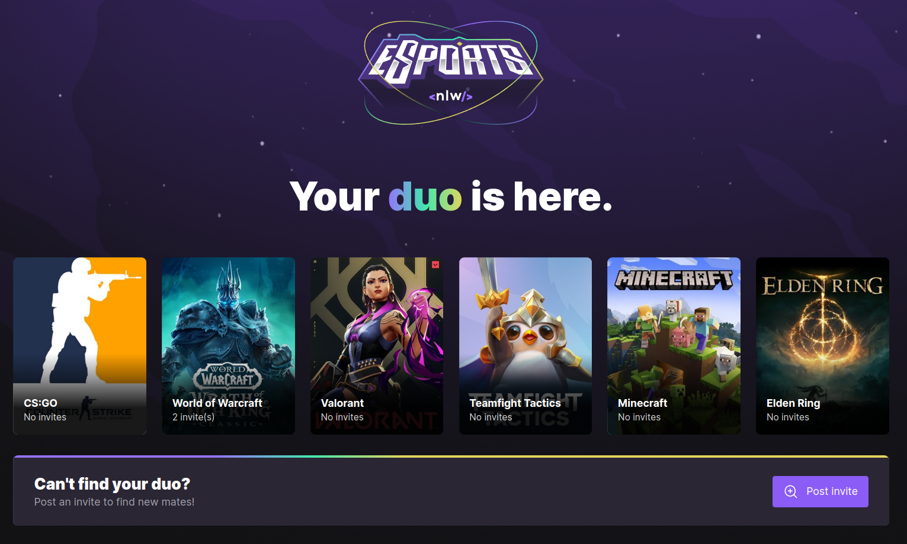

<h1 align="center">
    NLW eSports | Find your duo!
</h1>

<p align="center">
  <a href="#-tech">Tech</a>&nbsp;&nbsp;&nbsp;|&nbsp;&nbsp;&nbsp;
  <a href="#-project">Project</a>&nbsp;&nbsp;|&nbsp;&nbsp;&nbsp;
  <a href="#-run">Run</a>&nbsp;&nbsp;|&nbsp;&nbsp;&nbsp;
  <a href="#-extras">Extras</a>&nbsp;&nbsp;
</p>

<p align="center">
  
</p>

## 🔧 Tech

This project has been developed with:

- [Node.js](https://nodejs.org/en/)
- [React](https://reactjs.org)
- [React Native](https://facebook.github.io/react-native/)
- [Expo](https://expo.io/)
- [TypeScript](https://www.typescriptlang.org/)
- [Prisma](https://www.prisma.io/)
- [RedixUI](https://www.radix-ui.com/)
- [TailwindCSS](https://tailwindcss.com/)
- [Express](https://expressjs.com/)

## 💻 Project

This is a meeting platform, where you can post invites to specific games that you like, so other people will see it and match you in a duo.

## 🚦 Run

This project can be executed in mobile or web version.

1. Before anything, start server.

- Server

```bash
# nlw-esports/server
npm run dev
```

2. Choose between mobile or web

- Web version

```bash
# nlw-esports/web
npm run dev
```

- Mobile version
  - to run mobile version you must first change mobile/libs/api.ts
    - in this file you can change IP variable to your machine IPV4 Address.
  - its also needed that you have a compatible mobile emulator or expo go installed in your phone.

```bash
# nlw-esports/mobile
expo start
```

3. If you want, you can also see database, to do this, run:

```bash
# nlw-esports/server
npx prisma studio
# this will open prisma studio into your main browser, so you can look at database
```

### 📎 Extras

In this project I could get more knowledge with React Native and React Hooks. Also has been a awesome experience coding a Back-end, since I almost only code Front-end. Back-end has been developed with Express, creating a RESTful API.

---

This project was guided and inspired by [Rocketseat](https://www.rocketseat.com.br/)
